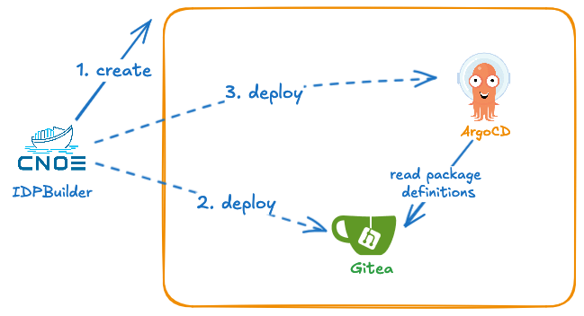

## Introduction
idpBuilder is a powerful tool that enables you to easily spin up a complete internal developer platform (IDP) on your local machine. By leveraging industry-standard technologies like Kubernetes, ArgoCD, and Backstage, idpBuilder provides a comprehensive and reliable solution for setting up a reference IDP implementation. The key differentiator of idpBuilder is that it requires only Docker as a local dependency, making it accessible and easy to set up on a wide range of development environments.

The key purpose of idpBuilder is to simplify the process of creating and managing an IDP environment, allowing developers, DevOps engineers, and platform teams to focus on their core responsibilities without getting bogged down in complex infrastructure setup and configuration.

With idpBuilder, you can achieve the following benefits:

* **Reference IDP Implementation**: idpBuilder provides a pre-configured and opinionated IDP setup, allowing you to quickly create a reference implementation that can be used for demonstrations, proofs of concept, and training purposes.

* **Integration Testing**: By running idpBuilder on a local machine, you can use the resulting IDP environment for integration testing of your applications and services, ensuring seamless deployment and functionality before pushing to production.

* **Local Development for IDP Engineers**: idpBuilder can serve as a powerful local development environment for IDP engineers, enabling them to experiment with new features, test configurations, and validate updates to the IDP platform without impacting production systems.

By leveraging idpBuilder, teams can accelerate their cloud-native adoption, improve developer productivity, and enhance the overall efficiency of their internal developer platform, all while adhering to industry-standard practices and technologies.

# Overview

When idpbuilder creates an environment for you, it performs the following tasks.

- **1.** idpbuilder creates a local kind cluster if one does not exist yet
  - Create a [self-signed certificate](./idpbuilder/how-it-works#self-signed-certificate), then set it as the default TLS certificate for ingress-nginx.
  - Configure [CoreDNS](./idpbuilder/how-it-works#dns-configuration) to ensure names are resolved correctly.
- **2.** idpbuilder installs the following core packages to the cluster.
  - **ArgoCD** is the GitOps solution to deploy manifests to Kubernetes clusters. In this project, a package is an ArgoCD application.
  - **Gitea** server is the in-cluster Git server that ArgoCD can be configured to sync resources from. You can sync from local file systems to this. This Gitea installation includes an embedded [OCI-compliant container registry](./idpbuilder/how-it-works/#local-oci-registry) for hosting container images as "packages" .
  - **Ingress-nginx** is used as a method to access in-cluster resources such as ArgoCD UI and Gitea UI.
- **3.** Once the core pacakages are installed, idpbuilder passes control over these packages to ArgoCD by storing manifests in Gitea repositories then creating ArgoCD applications. From here on, ArgoCD manages them based on manifests checked into Git repositories.

For more detail on idpbuilder architecture and project information check [idpbuilder contribution](https://github.com/cnoe-io/idpbuilder/blob/main/CONTRIBUTING.md#architecture).