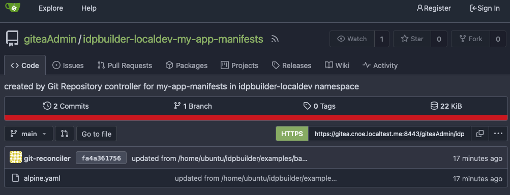
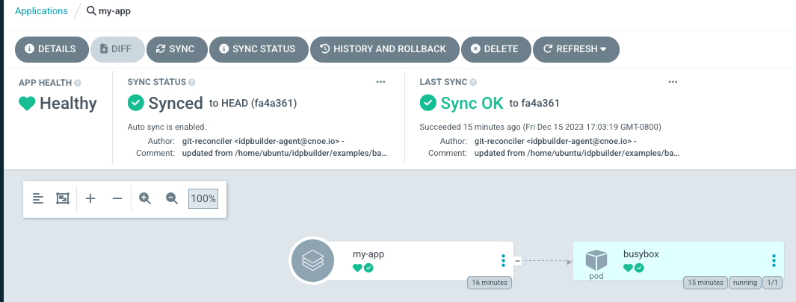

A Stack is a collection of Argo CD applications that defines what components should be included in an Internal Developer Platform (IDP). It works in tandem with Idpbuilder, where the Stack specifies "what" needs to be installed while Idpbuilder handles "how" to install it. To distinguish it from general technology stacks, it's specifically referred to as a "CNOE IDP stack" or "IDP stack."

Each Stack can contain varying numbers of packages, where each package represents an Argo CD application. For example, one stack might include 4 packages while another might contain 10, depending on specific requirements. The stack implementation supports two primary integration mechanisms: local integration, which works with local files pushed into a Git repository using the 'kube' scheme, and remote integration, which can reference external repositories such as Helm charts.

This decoupled approach provides flexibility in that anyone can create their own custom stack based on new technologies not captured in existing stacks, and these can be published in the stacks repository for others to use.

## Prerequisites

Ensure you have completed the following setup

- Complete the [idp Reference Prerequisite setup](../idp-ref/idp-ref.md#prerequisites)
- Complete the [idp Reference Installation setup](../idp-ref/idp-ref.md#installation)

## Create stack in CNOE idp

Idpbuilder supports adding stack by specifying custom packages using the flag `-p` flag. This flag expects a directory (local or remote) containing ArgoCD application files and / or ArgoCD application set files. In case of a remote directory, it must be a directory in a git repository, and the URL format must be a [kustomize remote URL format](https://github.com/kubernetes-sigs/kustomize/blob/master/examples/remoteBuild.md).

Localstack. Use LocalStack to test out cloud integrations.
Terraform Integrations. Integrating Terraform with Reference Implementation.
Dapr Integration. Integrating the Dapr APIs for Building Secure and Reliable Microservices .

### Following area the CNOE idp stacks that are currently available. 

| CNOE idp Stack   | Mantainer | Respoistory Location | Description |
|--------------|-------------|-----------|-------------------|
| Localstack | CNOE | [stacks/localstack-integration/](https://github.com/cnoe-io/stacks/tree/main/localstack-integration) | Deploys an IDP reference implementation with an Argo application that adds Localstack, as well as integrating with Crossplane.|
| Local Backup | CNOE | [stacks/local-backup/](https://github.com/cnoe-io/stacks/blob/main/local-backup) | creates a configuration that allows you to back up Kubernetes objects to your local machine (or wherever you are running idpbuilder from) |
| Terraform Integrations | CNOE | [stacks/terraform-integrations/](https://github.com/cnoe-io/stacks/tree/main/terraform-integrations) | The deployment automation capabilities of this stack include automated syncing of Terraform configuration from a Git repository using the FluxCD source repository controller, and a custom "tofu-controller" that manages the full lifecycle of Terraform deployments directly from the Kubernetes cluster. |
| Dapr Integrations | CNOE | [stacks/dapr-integration/](https://github.com/cnoe-io/stacks/tree/main/dapr-integration) | provides a Dapr integration for the idpBuilder tool, allowing users to easily deploy a Dapr control plane, state store, and pub/sub components along with a Redis instance to support them. |
| Crossplane Integrations | CNOE | [stacks/crossplane-integrations/](https://github.com/cnoe-io/stacks/tree/main/crossplane-integrations) | provides a way to deploy applications with cloud resources using Backstage templates, where the cloud resources are managed and provisioned by Crossplane, a Kubernetes-native control plane for cloud services. |
| Istio-Ambient Stack | Community | [stacks/istio-ambient/](https://github.com/cnoe-io/stacks/tree/main/istio-ambient) | installs the Istio Ambient mesh and supporting observability tools to monitor traffic, metrics, and traces. |
| Jupyterhub Stack | Community | [stacks/jupyterhub/](https://github.com/cnoe-io/stacks/tree/main/jupyterhub) | deploys a JupyterHub instance that is integrated with Keycloak for single sign-on (SSO) authentication. |
| Kyverno Stack | Community | [stacks/kyverno-integration/](https://github.com/cnoe-io/stacks/tree/main/kyverno-integration) | implements Kyverno, a Kubernetes native policy management engine, to provide policy enforcement and audit capabilities for a Kubernetes platform. |
| vcluster multi-env | Community | [stacks/vcluster-multi-env/](https://github.com/cnoe-io/stacks/tree/main/vcluster-multi-env) | creates a multi-environment emulation setup on top of CNOE, allowing you to easily manage and enroll multiple vClusters (e.g. staging and production) in your ArgoCD deployment. |

### Create a basic CNOE idp stack

Let's take a look at [this example](https://github.com/cnoe-io/stacks/tree/main/basic). This defines two custom package directories to deploy to the cluster.

To deploy these packages, run the following command:

```
./idpbuilder create \
  -p https://github.com/cnoe-io/stacks//basic/package1 \
  -p https://github.com/cnoe-io/stacks//basic/package2
```

Alternatively, you can use the local directory format.

```bash
# clone the stacks repository
$ git clone https://github.com/cnoe-io/stacks.git
$ cd stacks
# run idpbuilder against the local directory
$ ./idpbuilder create \
  -p examples/basic/package1\
  -p examples/basic/package2
```

Running this command should create three additional ArgoCD applications in your cluster.

```bash
$ kubectl get Applications -n argocd  -l example=basic
NAME         SYNC STATUS   HEALTH STATUS
guestbook    Synced        Healthy
guestbook2   Synced        Healthy
my-app       Synced        Healthy
```

Let's break this down. The [first package directory](https://github.com/cnoe-io/stacks/tree/main/basic/package1) defines an application. This corresponds to the `my-app` application above. In this application, we want to deploy manifests from local machine in GitOps way.

The directory contains an [ArgoCD application file](https://github.com/cnoe-io/stacks/blob/main/basic/package1/app.yaml).  This is a normal ArgoCD application file except for one field.

```yaml
apiVersion: argoproj.io/v1alpha1
kind: Application
spec:
  source:
    repoURL: cnoe://manifests
```

The `cnoe://` prefix in the `repoURL` field indicates that we want to sync from a local directory.
Values after `cnoe://` is treated as a relative path from this file. In this example,
we are instructing idpbuilder to make ArgoCD sync from files in the [manifests directory](https://github.com/cnoe-io/stacks/tree/main/basic/package1/manifests).

As a result the following actions were taken by idpbuilder:
1. Create a Gitea repository.
2. Fill the repository with contents from the manifests directory.
3. Update the Application spec to use the newly created repository.

You can verify this by going to this address in your browser: https://gitea.cnoe.localtest.me:8443/giteaAdmin/idpbuilder-localdev-my-app-manifests




This is the repository that corresponds to the [manifests](https://github.com/cnoe-io/stacks/tree/main/basic/package1/manifests) folder.
It contains a file called `alpine.yaml`, synced from the `manifests` directory above.

You can also view the updated Application spec by going to this address: https://argocd.cnoe.localtest.me:8443/applications/argocd/my-app




The second package directory defines two normal ArgoCD applications referencing a remote repository.
They are applied as-is.

